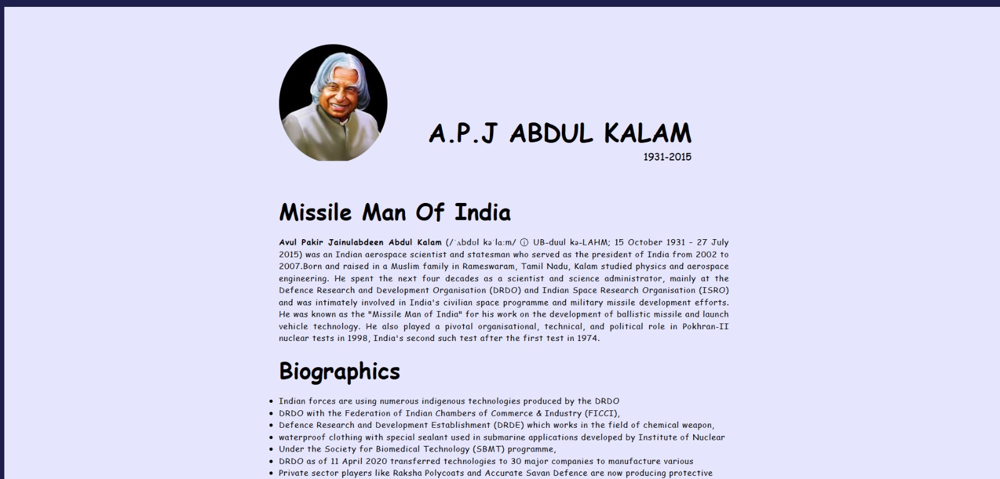
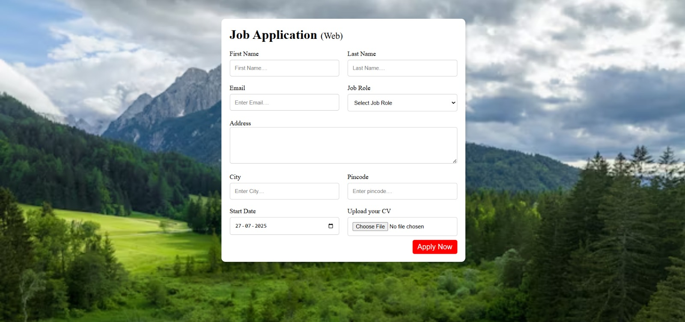
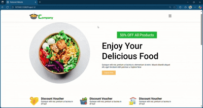

# HTML CSS Small Projects

This repo contains small practice projects using only HTML and CSS.

## 📁 Project-1: Tribute Page

A tribute page dedicated to [A.P.J Abadul Kalam].

### 🔍 Screenshot

Created with 💙 by Pooja.

---

### 📁 Project-2: Job Application Form

A simple job application form built using HTML and CSS. It contains form fields such as name, email, experience, and a submit button.

🔍 **Tech Used:** HTML + CSS

📸 **Screenshot:**

---

## 📁 Project-3: Parallax Website

A basic parallax scrolling website using HTML and CSS.

🔍 **Tech Used**: HTML + CSS

📸 **GIF Preview**:

🎯 **Features**:
- Parallax scrolling effect
- Responsive layout
- Simple and clean design

# 📱 Project-4: Developer Landing Page

A clean and modern developer landing page built using HTML and CSS. This page showcases different development domains and is fully responsive across devices.

---

## 🔧 Tech Used:
- HTML5
- CSS3

---

## 📽️ GIF Preview:

---

## 🎯 Features:

- 📱 **Responsive Design** — Mobile-friendly layout that adapts to all screen sizes.
- ✨ Clean and minimal design.
- 📂 Organized sections for:
  - Web Development
  - Mobile Development
  - UI/UX Design
  - Full-stack Development

---

## 📁 Folder Structure:

# 🍉 Project-5: Responsive Landing Page

A modern, clean, and responsive landing page built with **HTML** and **CSS**. This project showcases a grid-based product/service layout, perfect for real-world websites. It’s part of my hands-on practice to improve layout design and responsive UI skills.

---

## 📚 What I Learned

While creating this landing page, I worked on:

- ✅ **CSS Grid Layout** for product arrangements
- ✅ **Responsive Web Design** using media queries
- ✅ Using **Flexbox** for header and footer layout
- ✅ **Box Model**, spacing, and alignment
- ✅ Designing **mobile-first** UI

This helped me enhance my CSS structure, responsive layout building, and confidence in creating more complex designs.

---

## 🛠️ Tech Stack

- **HTML5**
- **CSS3**
  - CSS Grid
  - Flexbox
  - Media Queries

---

## ✨ Features

- 📱 **Fully responsive** on all screen sizes
- 💡 Clean, structured HTML and modular CSS
- 🖼️ Grid-based product layout with images
- 🧰 Realistic use-case: service/product showcase landing page

# Project-6: music Website

### 👩‍💻 Day 6 - HTML CSS Small Projects Challenge

A **professional Apple landing page clone**, fully responsive and visually appealing, built using:

- ✅ CSS Flexbox  
- ✅ CSS Box Model  
- ✅ Responsive Layout Techniques  
- ✅ CSS Positioning (Relative, Absolute)  

---

## 📸 Demo

---

---

## 🧠 What I’m Learning

This project helped me improve:

- Understanding of **CSS Flexbox**  
- Mastering layout structure using the **Box Model**  
- Creating **pixel-perfect landing pages**  
- Working with **image overlays, alignment, and responsiveness**

---

